# Spotify v2 Data Audit Visual Report

### Audit Summary: AGGREGATE
| Metric | Value |
| :--- | :--- |
| Total Streams | 141,144 |
| Start Date | 2013-09-27 05:51:09+00:00 |
| End Date | 2026-04-13 23:04:26+00:00 |

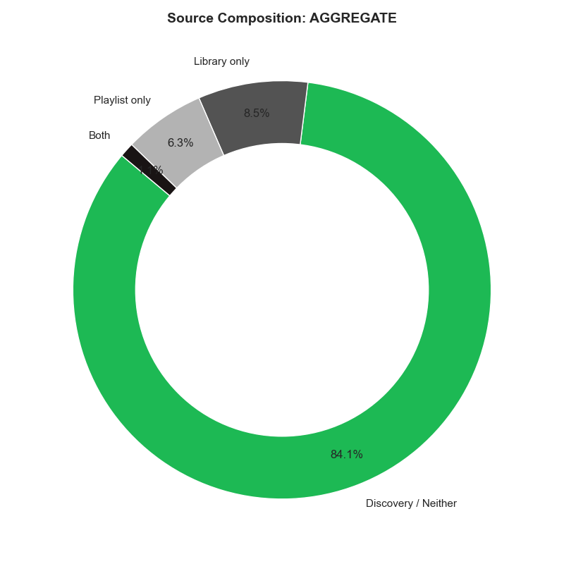

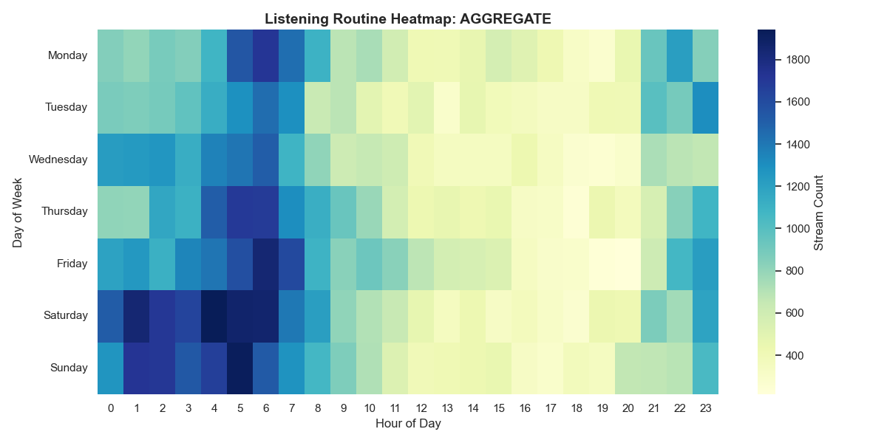

---

### Audit Summary: AMA
| Metric | Value |
| :--- | :--- |
| Total Streams | 60,278 |
| Start Date | 2016-09-21 04:49:49+00:00 |
| End Date | 2025-12-21 05:50:20+00:00 |

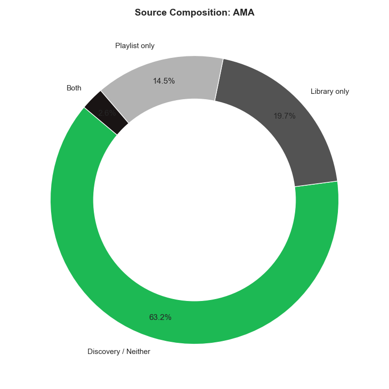

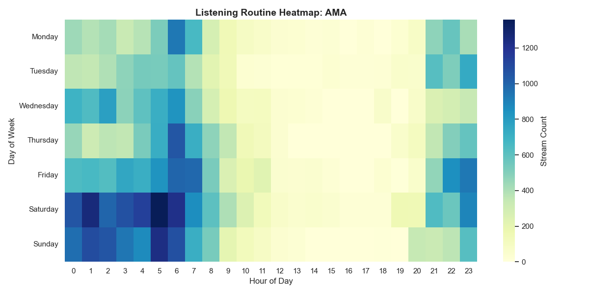

---

### Audit Summary: ANGIE
| Metric | Value |
| :--- | :--- |
| Total Streams | 41,704 |
| Start Date | 2021-08-30 14:39:43+00:00 |
| End Date | 2026-04-13 23:04:26+00:00 |

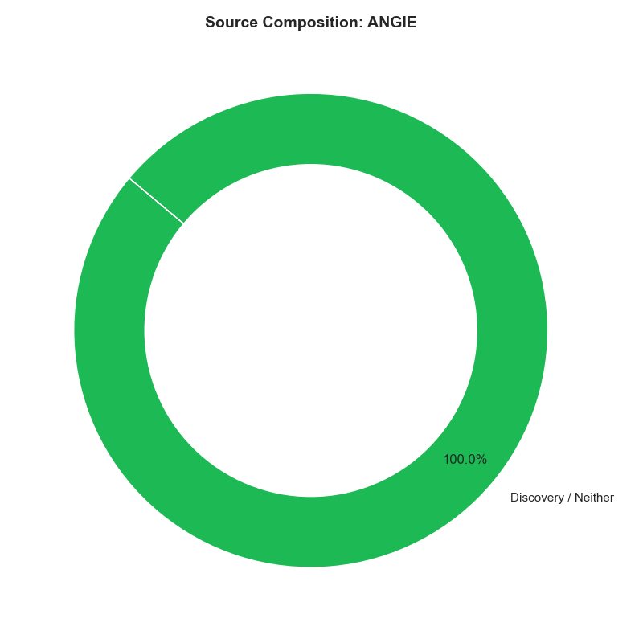

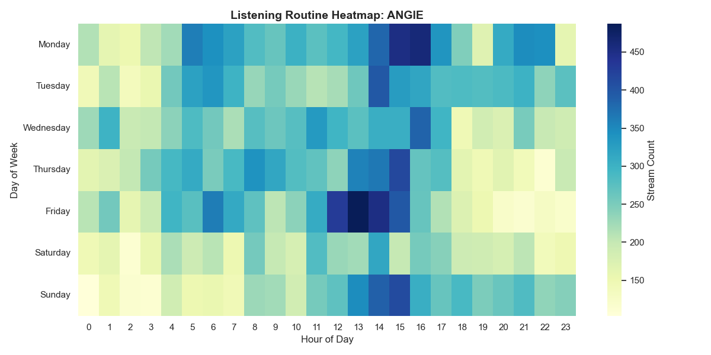

---

### Audit Summary: KEN
| Metric | Value |
| :--- | :--- |
| Total Streams | 92 |
| Start Date | 2018-11-24 09:20:41+00:00 |
| End Date | 2025-05-12 13:47:15+00:00 |

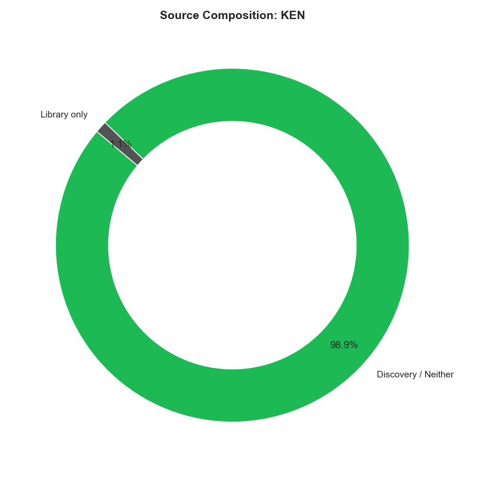

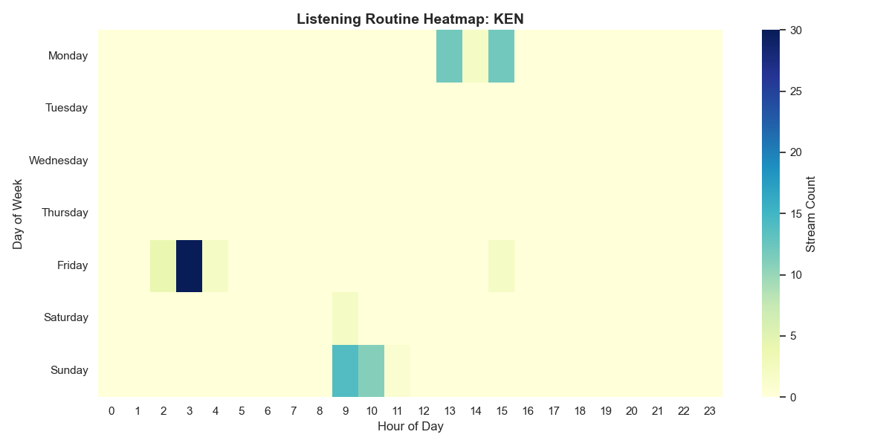

---

### Audit Summary: P1
| Metric | Value |
| :--- | :--- |
| Total Streams | 2,420 |
| Start Date | 2013-09-27 05:51:09+00:00 |
| End Date | 2025-06-20 06:13:39+00:00 |

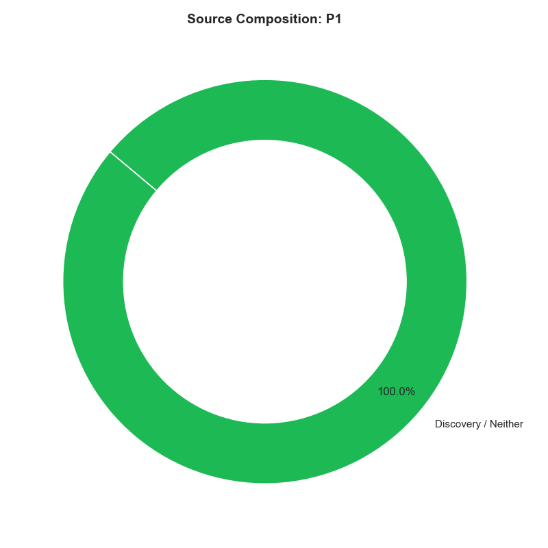

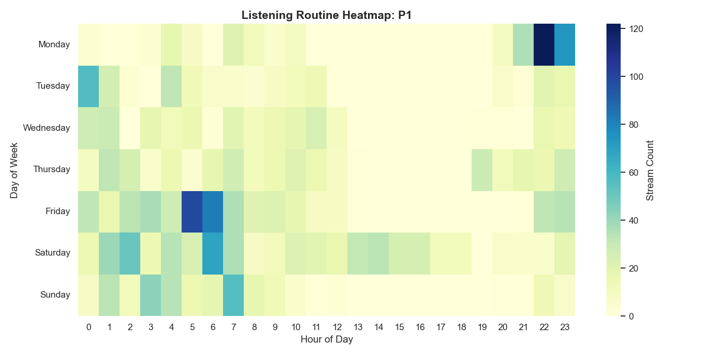

---

### Audit Summary: P2
| Metric | Value |
| :--- | :--- |
| Total Streams | 36,650 |
| Start Date | 2015-08-27 09:32:24+00:00 |
| End Date | 2026-02-05 19:12:29+00:00 |

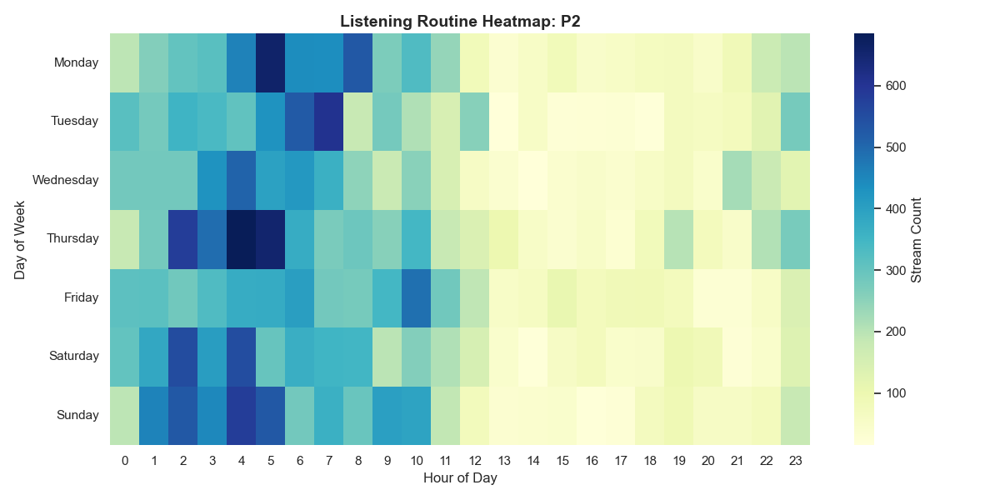

---
